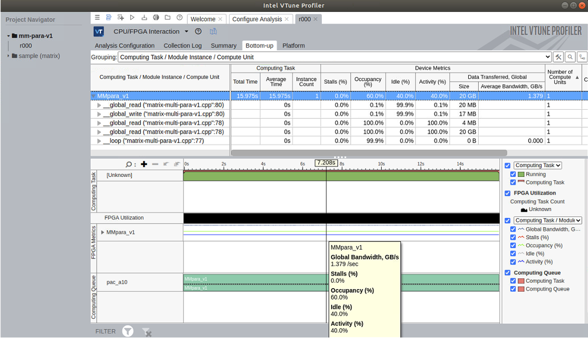

# Lab 4: Static Analysis and Run-time Profiling 

This page contains the instructions of Lab 4 for EECE.6540 Heterogeneous Computing at UMass Lowell.

We use matrix multiplication example to show how to use Intel's FPGA optimization tools for analyzing and optimizing a DPC++ design. Specifically we show how to use compilation reports to analyze a design and how to perform run-time profiling. A few design options are compared side by side in terms of programming APIs, resource utilization, area and performance.

| Optimized for                     | Description
|:---                               |:---
| OS                                | Linux* Ubuntu* 18.04
| Hardware                          | Skylake with GEN9 or newer, Intel(R) Programmable Acceleration Card with Intel(R) Arria(R) 10 GX FPGA
| Software                          | Intel&reg; oneAPI DPC++ Compiler (beta)  
  
The compilation and run-time profiling are performed on Intel FPGA DevCloud, a free development platform.

## Purpose

We use matrix-multi example to demonstrate the design and optimization flow for DPC++ programs targeted for FPGA hardware. 

DPC++ supports kernel functions that define how computation is carried out on a partition of the whole dataset or task. It is important to understand different design options and seek the best suitable design for a particular algorithm. Due to the unique characteristics of FPGA targets, Intel provides a set of tools we can leverage to investigate resource utilizations and identify bottlenecks. Lab 4 is to demonstrate the usage of these tools with `matrix-multi' example.

## Key Implementation Details 

The DPC++ implementations explained in the several versions covers basic concepts of DPC++ programming such as device selector, parallel_for(), single_task(), loop unrolling. In the st-v3 version, we introduce the tile concept that relies on the usage of local memory to reduce the cost of accessing global memory.

## License  
This code sample is licensed under MIT license. 


## Part I: Static Analysis with Compiler-generated Reports

### On DevCloud

**The project uses CMake. Perform the following steps to build different targets.** 

```
    mkdir build
    cd build
    cmake ..
    make
    make report
```

* make report : generate static report on the FPGA resource utilization of the designs. 

For each design (each .cpp file in src/ folder), a folder containing reports will be generated after executing "make report". For example, a folder called "matrix-multi-st-v1_report.prj/" is created for source code "matrix-multi-st-v1.cpp". In this folder, there is a subdirectory called "reports/", which in turn contains the results obtained from the DPC++ compiler. You will need to copy the entire 'reports' folder from DevCloud to your local computer by following the next few steps.

1) On DevCloud, create a tar ball for the "reports/" folder (using v1 as an example in this case.)
```
    cd matrix-multi-st-v1_report.prj/
    tar zcvf reports-v1.tgz reports/
    pwd
```
* 'pwd' shows you the full path of the tar ball file, for example, /home/uxxxxx/projects/dpcpp-tutorial/matrix-multi/build/matrix-multi-st-v1_report.prj . You need to record this path so that the following scp command can copy the tar ball file.

### On Local Computer

2) On your local computer, use scp to copy the reports-v1.tgz from DevCloud to a local folder.
```
    scp devcloud:/home/uxxxxx/projects/dpcpp-tutorial/matrix-multi/build/matrix-multi-st-v1_report.prj/reports-v1.tgz .
```
Note that you need to replace the full path with the output from your 'pwd' command in Step 1).

If this command completes successfully, you will see 'reports-v1.tgz' appear in your local folder.

3) On your local computer, untar the tar ball file to extract the full content under "reports" folder.
```
    tar zxvf reports-v1.tgz
```
Alternatively, you can double-click the tar file (reports-v1.tgz) to extract the full content. Either way, you should see a folder named "reports" created on your local computer.

4) View the static analysis of your design using a browser. You can open the file named "report.html" using your favorite browser and navigate through different report sections (Summary, Throughput, Area, System Viewers). Detailed explainations are available in [Intel® oneAPI DPC++ FPGA Optimization Guide](https://software.intel.com/content/www/us/en/develop/download/oneapi-fpga-optimization-guide.html)

An example view is as follows.


## Part II: Run-time Analysis with Profiling Tools

You will need to first build the FPGA binary files, then execute them on DevCloud and collect profiling data, which can be viewed with Intel VTune Profiler on your local computer. The steps are as follows:

### On DevCloud

Launch batch script to build FPGA binary, execute, and collect profiling data.

1) Login to the head node of DevCloud, build FPGA binary using batch script.

```
cd dpcpp-tutorial/matrix-multi
devcloud_login -b A10OAPI A10_oneapi_batch-fpga-profile.sh
```

This script will launch a job to generate FPGA binary files with profiling counters built-in. This job may take several hours.

2) execute the FPGA binary on a Devcloud Compute Node with Arria 10 and collect profiling data. (use v1 as an example)

```
cd newbuild_A10_profile
./matrix-multi-st-v1.fpga_profile
aocl profile -no-json ./matrix-multi-st-v1.fpga_profile
aocl profile -no-run profile.mon ./matrix-multi-st-v1.fpga_profile
```

There are two files generated: profile.mon and profile.json, which are needed for visualized analysis with Intel VTune Profiler.

3) pack the profiling data and FPGA binary into a tar ball.
```
mkdir st-v1-profile
cp profile.mon profile.json ./matrix-multi-st-v1.fpga_profile st-v1-profile
tar zcvf st-v1-profile.tgz st-v1-profile/
``` 


### On Local Computer

4) Transfer the tar ball to your local computer, and extract the files
```
scp devcloud:<full_path>/st-v1-profile.tgz .
tar zxvf st-v1-profile.tgz
```
The files are extracted to a folder named "st-v1-profile".

5) Install Intel VTune Profiler by following the [Installation Guides](https://software.intel.com/content/www/us/en/develop/documentation/vtune-help/top/installation.html)


6) Open the profile.* files with VTune (please refer to the recorded lecture on "[Design Analysis (II): Runtime Profiling @ 2:53](https://youtu.be/q2KZvAqhN_s?t=173)" for more information)

Sample Profiling View with VTune Profiler


## Recorded Lectures

A series of recorded lectures are provided to introduce the important concepts about DPC++ programming for FPGAs. The videos can be found at the [DPC++ Tutorial playlist](https://youtube.com/playlist?list=PLZ9YeF_1_vF8RqYPNpHToklJcDRoVocU4) on Youtube and are linked individually below. 

[Introduction to DPC++](https://youtu.be/F2DWVuJRvfM)

[How to Think "in Parallel"?](https://youtu.be/3DTYEBSrj-U)

[FPGA Design Concepts](https://youtu.be/dLGY7_ql1H8)

[Design Analysis (I): FPGA Early Image](https://youtu.be/zpPbn0eOCg8)

[Design Analysis (II): Runtime Profiling](https://youtu.be/q2KZvAqhN_s)
